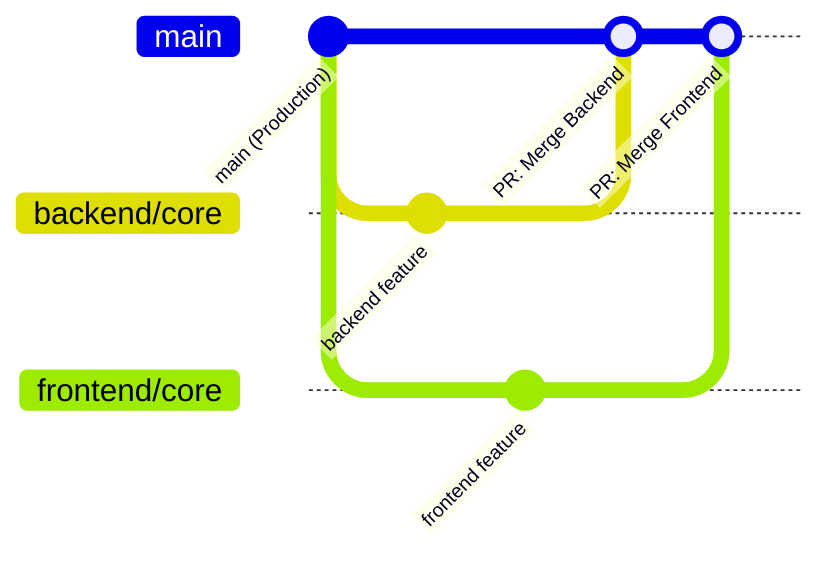

# 🏢 Fifth Events — Enterprise Event & Lead Management Platform

Welcome to **Fifth Events**, the enterprise event management, lead conversion, and attendance manifest platform designed for [The FifthLab](https://thefifthlab.com/).

---

## 👥 Team & Ownership

| Role | Team Member | Primary Directory | Dedicated Git Branch |
|---|---|---|---|
| **Backend & Database** | **Abraham Akinwole** | [`backend/`](./backend/) | `backend/core` |
| **Frontend & UI/UX** | **Folajimi Ajayi** | [`frontend/`](./frontend/) | `frontend/core` |

---

## 🌿 Git Branching & Collaboration Workflow

> ⚠️ **CRITICAL RULE:** **NEVER push directly to `main`.** Production auto-deploys from `main`. All work must be developed, tested locally, and merged via Pull Request.



---

### 🚀 Step-by-Step Instructions per Member

### 1️⃣ For Abraham (Backend Lead)

#### First-time Setup:
```bash
git fetch origin
git checkout backend/core
cd backend
npm install
cp .env.example .env
npm run prisma:generate
```

#### Daily Work Loop:
```bash
# 1. Sync latest main into your branch
git checkout backend/core
git pull origin main

# 2. Make your backend changes in backend/

# 3. Commit your work
git add backend/
git commit -m "feat(backend): implement event rsvp endpoints"

# 4. Push to your remote branch
git push -u origin backend/core
```

#### Pre-Merge Test Checklist (Must pass before merging to `main`):
```bash
cd backend
npx tsc --noEmit        # Must have 0 TypeScript errors
npm run dev             # Verify API runs cleanly on http://localhost:5000
```

---

### 2️⃣ For Folajimi (Frontend Lead)

#### First-time Setup:
```bash
git fetch origin
git checkout frontend/core
cd frontend
npm install
```

#### Daily Work Loop:
```bash
# 1. Sync latest main into your branch
git checkout frontend/core
git pull origin main

# 2. Make your UI changes in frontend/

# 3. Commit your work
git add frontend/
git commit -m "feat(frontend): redesign public event cards"

# 4. Push to your remote branch
git push -u origin frontend/core
```

#### Pre-Merge Test Checklist (Must pass before merging to `main`):
```bash
cd frontend
npm run build           # Must compile cleanly with 0 errors
```

---

### 3️⃣ Merging Changes to `main` (Production Release)

1. Go to GitHub repository -> **Pull Requests** -> **New Pull Request**.
2. Set **Base:** `main` ⟵ **Compare:** `backend/core` or `frontend/core`.
3. Review files changed and click **Create Pull Request**.
4. Once verified, click **Merge Pull Request**.
5. Vercel automatically deploys the updated `main` branch to production without build errors.

---

## 🗂️ Project Directory Structure

```
events-app/
├── 📂 frontend/               # Next.js 16 Client & Dashboard Web App (Folajimi)
│   ├── app/                  # Next.js App Router pages (/, /dashboard, /demo, /login)
│   ├── components/           # UI components, event cards, forms, navigation
│   ├── context/              # Global application state (AppContext)
│   ├── lib/                  # Utilities, mock data, and local helper functions
│   ├── public/               # Static assets, logos, brand images
│   ├── package.json          # Frontend dependencies & scripts
│   └── README.md             # Frontend specific setup guide
│
├── 📂 backend/                # Server & API Service (Abraham)
│   ├── prisma/               # Prisma schema & PostgreSQL migration definitions
│   │   └── schema.prisma     # Models: User, Event, AttendanceRecord, Lead, Product
│   ├── src/
│   │   ├── db/               # Prisma client singleton and database seed script
│   │   ├── middleware/       # Auth guards, @thefifthlab.com domain filter, error handlers
│   │   ├── routes/           # API routes (events, leads, products, auth)
│   │   ├── services/         # Nodemailer email dispatch, QR code badge generator
│   │   └── index.ts          # Express API server entry point
│   ├── .env.example          # Environment variables template (Neon DB, NextAuth, Azure AD)
│   ├── package.json          # Backend dependencies & scripts
│   └── README.md             # Backend specific setup guide
│
└── 📂 shared/                 # Shared TypeScript Definitions
    ├── types.ts              # Data contracts, event models, user roles, lead statuses
    ├── constants.ts          # Event categories, priorities, FifthLab solution definitions
    └── index.ts              # Central export barrel
```

---

## ⚡ Local Development Quick Reference

### Frontend:
```bash
cd frontend && npm run dev
```
> Runs on **`http://localhost:3000`**

### Backend:
```bash
cd backend && npm run dev
```
> Runs on **`http://localhost:5000`**
